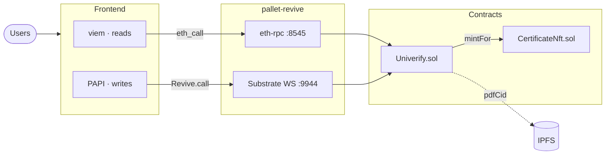
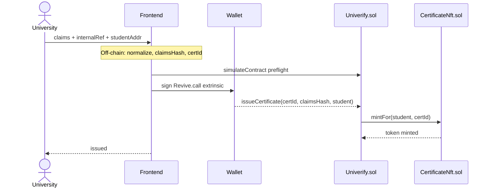
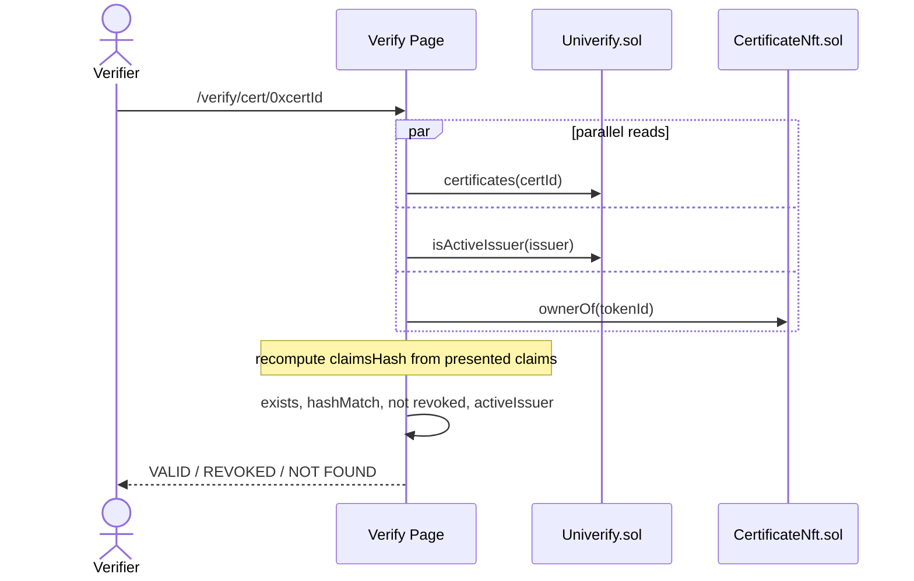
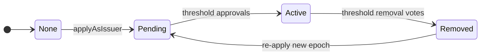

# Univerify

*Federated Academic Credential Registry on Polkadot*

---

## Motivation & The Problem

- Degree verification today means **calling the institution** — slow, opaque, fails when it closes
- PDF diplomas carry **no cryptographic link** to the issuer — forged in minutes
- Existing blockchain credentials tied to **a single admin key** — same single point of failure
- **Core question:** Who is the authority, and can we build without one?

Note:
Open with personal story (~20 sec). The point is structural: any single authority is a failure mode. Lead into — what if the authority was a protocol, not a person?

---

## A Web3 Approach

- **Credential = keccak256(canonical claims)** — a hash, not a PDF. No document on-chain.
- **No PII on-chain** — holder name never touches the chain; only the hash.
- **Federated registry** — active universities govern admission and removal; no owner, no admin key
- **Soulbound NFT** — non-transferable ERC-721 minted atomically, binds credential to holder's wallet
- **Hybrid runtime** — Solidity contracts on Polkadot via pallet-revive

Note:
Core insight: you verify a hash against a registry, not a document. PII constraint is deliberate — a compromised chain reveals nothing about holders. "No owner" is the design: every write privilege flows from Active-issuer status. pallet-revive = EVM execution inside a Substrate runtime; Polkadot wallets sign as Substrate extrinsics.

---

## Architecture

Note:
READ path (top): viem makes eth_call over the Ethereum-compatible RPC. WRITE path (bottom): PAPI signs a pallet_revive::call Substrate extrinsic. Polkadot wallets cannot sign Ethereum transactions — these two paths are why. Pre-flight simulateContract before every write: pallet-revive wraps all EVM reverts into a generic ContractReverted; simulation decodes the exact Solidity error name.

---

## Issuing a Certificate

Note:
Off-chain before wallet prompt: NFC + uppercase + trim normalization, keccak256 hash, certId = keccak256(issuer + internalRef). Preflight decodes exact Solidity error name. issueCertificate + mintFor is atomic — both succeed or both revert. No PII on-chain — only the hash, issuer address, timestamp, revocation flag.

---

## Verifying a Certificate

Note:
Three reads fire in parallel — no sequential dependency. Verifier supplies raw claims; hash recomputed client-side using the same normalization. Four independent trust signals: existence, integrity, revocation, issuer status. Historical verifiability: cert remains valid even if issuer is later removed by governance.

---

## Governance

- **No owner.** Every write privilege flows from Active-issuer status — no back door.
- Same `approvalThreshold` governs admission *and* removal — **symmetric trust**
- Re-application bumps `issuerEpoch` — prior approvals unreachable in **O(1)**, no iteration

Note:
Symmetric threshold: the quorum that lets you in can take you out. issuerEpoch trick: approvals keyed by (candidate, epoch, approver); increment epoch, old records are unreachable without touching them. Known trade-off: if active count drops below threshold, system deadlocks — accepted, recovery = redeploy.

---

## Demo

*Live on Paseo TestNet*

Note:
Switch to browser. Show: Governance (apply, approve). Issuance (fill claims, preflight, sign, NFT minted). Verify page (VALID result). My Certificates (student NFT enumeration).

---

## Limitations & The Bigger Picture

**Current gaps:**
- **pallet-revive** is maturing — preflight workaround required; proof-size limit raised from 256 KB → 1 MB
- **Wallet friction** — Polkadot account mapping is a real onboarding barrier
- **No selective disclosure** — full hash match or nothing; ZK proofs out of scope for this MVP

**Reputation Parachain:**
- Univerify is one vertical slice of a general reputation layer
- Same model generalises to any institution with domain authority: professional bodies, employers, skills
- Polkadot cross-chain messaging — a trust graph any parachain can query

Note:
The proof-size issue was a concrete blocker — we hit it and fixed it. The bigger picture: swap "university" for any issuing institution. Same governance, same verification logic. Polkadot's shared security makes it the right home for a trust graph that different chains can plug into.
